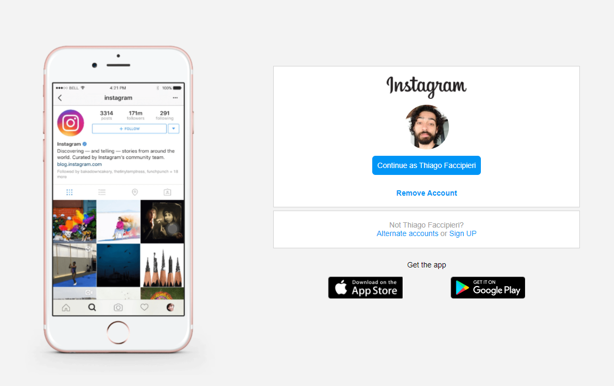
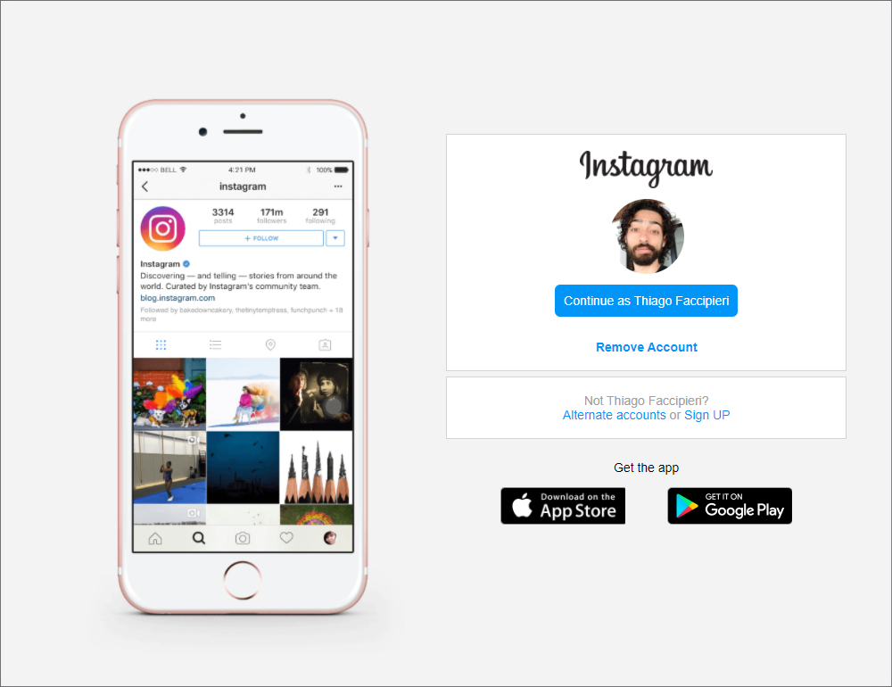
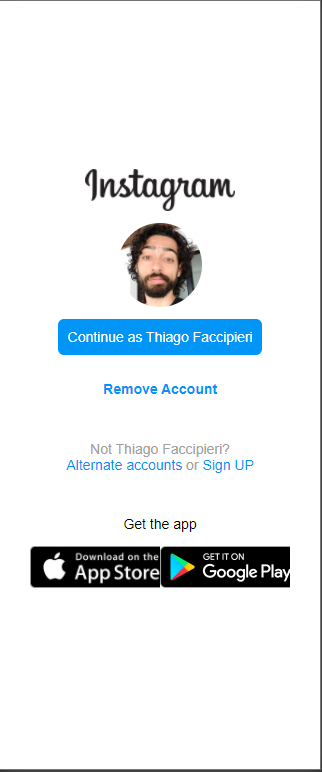

### Repositório criado para alocar o Clone da interface de login do Instagram, para o bootcamp Everis, fornecido pela Digital Innovation One

==================================================================================

### Imagens do Projeto e Código:
#### Tela em computadores com resolução superior a 1024px de largura

#### Telas de tablets entre 650 e 1024px de largura

#### Telas mobile menores que 650px mobile

